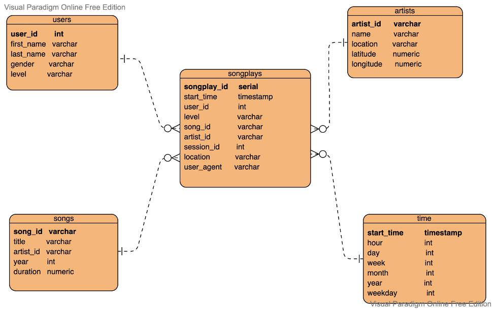

# Project: Data Modeling with Postgres

> by Keji Han, 10/10/2022

## Introduction
A startup called Sparkify wants to analyze the data they've been collecting on songs and user activity on their new music streaming app. The analytics team is particularly interested in understanding what songs users are listening to. Currently, they don't have an easy way to query their data, which resides in a directory of JSON logs on user activity on the app, as well as a directory with JSON metadata on the songs in their app.

They'd like a data engineer to create a Postgres database with tables designed to optimize queries on song play analysis, and bring you on the project. Your role is to create a database schema and ETL pipeline for this analysis. You'll be able to test your database and ETL pipeline by running queries given to you by the analytics team from Sparkify and compare your results with their expected results.

## Project Description
In this project, I build an ETL pipeline using Python. I was defined fact and dimension tables for a star schema for a particular analytic focus, and wrote an ETL pipeline that transfers data from files in two local directories into these tables in Postgres using Python and SQL.

## Project Datasets

### 1.Song Dataset
The first dataset is a subset of real data from the Million Song Dataset. Each file is in JSON format and contains metadata about a song and the artist of that song. The files are partitioned by the first three letters of each song's track ID. File example below:
`song_data/A/A/A/TRAAAAW128F429D538.json`
`song_data/A/B/C/TRABCAJ12903CDFCC2.json`

A single song file, TRAAAAW128F429D538.json, look like below:

`{"num_songs":1
"artist_id":"ARULZCI1241B9C8611"
"artist_latitude":null
"artist_longitude":null
"artist_location":""
"artist_name":"Luna Orbit Project"
"song_id":"SOSWKAV12AB018FC91"
title:"Midnight Star"
duration:335.51628
year:0}`

### 2.Log Dataset
The second dataset consists of log files in JSON format generated by this event simulator based on the songs in the dataset above. These simulate activity logs from a music streaming app based on specified configurations. File example below:

`log_data/2018/11/2018-11-12-events.json`
`log_data/2018/11/2018-11-13-events.json`

## Project Files
1. `test.ipynb`: displays the first few rows of each table to let you check your database.
2. `create_tables.py`: drops and creates your tables. Run this file to reset tables before each time you run your ETL scripts.
3. `etl.ipynb`: reads and processes a single file from `song_data` and `log_data` and loads the data into your tables. This notebook contains detailed instructions on the ETL process for each of the tables.
4. `etl.py`: reads and processes files from `song_data` and `log_data` and loads them into the tables. Can fill this out based on your work in the ETL notebook.
5. `sql_queries.py`: contains all sql queries, and is imported into the last three files above.
6. `README.md`: provides discussion on the project.

## Database Schema

### Tables
- 1 fact table named songplays
- 4 Dimension tables: users, songs, artists, time



## ETL pipeline
The ETL pipeline will extracts the data from JSON files song_data and log_data. Then transfer and load the song_data into the songs and artists dimensional tables. log_data into the time and users dimensional tables, as well as the songplays fact table.

## How to Run the Project
### Create Tables
- In terminal, Run `create_tables.py` to create your database and tables. CODE:`python create_tables.py`.

### Run ETL Pipeline
- In terminal, Run `etl.py` to ETL the data into the tables we created before. CODE:`python etl.py`.

- To check your data were successfully loaded into each tables, Run `test.ipynb`.

### Example Query
To check how many users are paid or unpaid to listen music.
```
%sql SELECT level, count(level) from users group by level
```
#### Result:
- free: 76
- paid: 20


