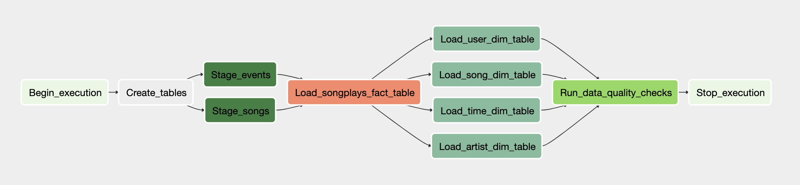

# Project: Data Pipelines with Airflow

## 1.Project Intro and Description

A music streaming company, Sparkify, has decided that it is time to introduce more automation and monitoring to their data warehouse ETL pipelines and come to the conclusion that the best tool to achieve this is Apache Airflow.

You will need to create high grade data pipelines that are dynamic and built from reusable tasks, can be monitored, and allow easy backfills. They have also noted that the data quality plays a big part when analyses are executed on top the data warehouse and want to run tests against their datasets after the ETL steps have been executed to catch any discrepancies in the datasets.

The source data resides in S3 and needs to be processed in Sparkify's data warehouse in Amazon Redshift. The source datasets consist of JSON logs that tell about user activity in the application and JSON metadata about the songs the users listen to.

## 2.Project Datasets

We'll be working with two datasets that reside in S3. Here are the S3 links for each:

    * Song data: s3://udacity-dend/song_data
    * Log data: s3://udacity-dend/log_data
    
### Song Dataset
The first dataset is a subset of real data from the Million Song Dataset. Each file is in JSON format and contains metadata about a song and the artist of that song. The files are partitioned by the first three letters of each song's track ID. For example, here are file paths to two files in this dataset.

    song_data/A/B/C/TRABCEI128F424C983.json
    song_data/A/A/B/TRAABJL12903CDCF1A.json
    
And below is an example of what a single song file, TRAABJL12903CDCF1A.json, looks like.

    {"num_songs": 1, "artist_id": "ARJIE2Y1187B994AB7", "artist_latitude": null, "artist_longitude": null, "artist_location": "", "artist_name": "Line Renaud", "song_id": "SOUPIRU12A6D4FA1E1", "title": "Der Kleine Dompfaff", "duration": 152.92036, "year": 0}
    
### Log Dataset
The second dataset consists of log files in JSON format generated by this event simulator based on the songs in the dataset above. These simulate app activity logs from an imaginary music streaming app based on configuration settings.

The log files in the dataset you'll be working with are partitioned by year and month. For example, here are file paths to two files in this dataset.

    log_data/2018/11/2018-11-12-events.json
    log_data/2018/11/2018-11-13-events.json

        
## 3.Configuring the DAG

In the DAG, add default parameters according to these guidelines
1. The DAG does not have dependencies on past runs
2. On failure, the task are retried 3 times
3. Retries happen every 5 minutes
4. Catchup is turned off
5. Do not email on retry

In addition, configure the task dependencies so that after the dependencies are set, the graph view follows the flow shown in the image below.
Working DAG with correct task dependencies:

## 4.Operators

### Stage Operator
The stage operator loads any JSON formatted files from S3 to Amazon Redshift. The operator creates and runs a SQL COPY statement based on the parameters provided.

### Fact and Dimension Operators
Two operators runs an SQL query to load data from the staging table to the fact and dimension tables.

### Data Quality Operator
The final operator is the data quality operator, which is used to run checks on the data itself. The operator's main functionality is to receive one or more SQL based test cases along with the expected results and execute the tests. For each the test, the test result and expected result needs to be checked and if there is no match, the operator should raise an exception and the task should retry and fail eventually.

## 5.Steps

1. Create an IAM User in AWS.
2. Create a redshift cluster in AWS.
3. After updated the DAG, run `/opt/airflow/start.sh` command to start the Airflow web server.
4. Once the Airflow web server is ready, you can access the Airflow UI by clicking on the blue `Access Airflow` button.
5. In Airflow UI, create 2 connections `aws credentials` and `redshift` to connect airflow with AWS.
6. Run DAG in Airflow UI.
